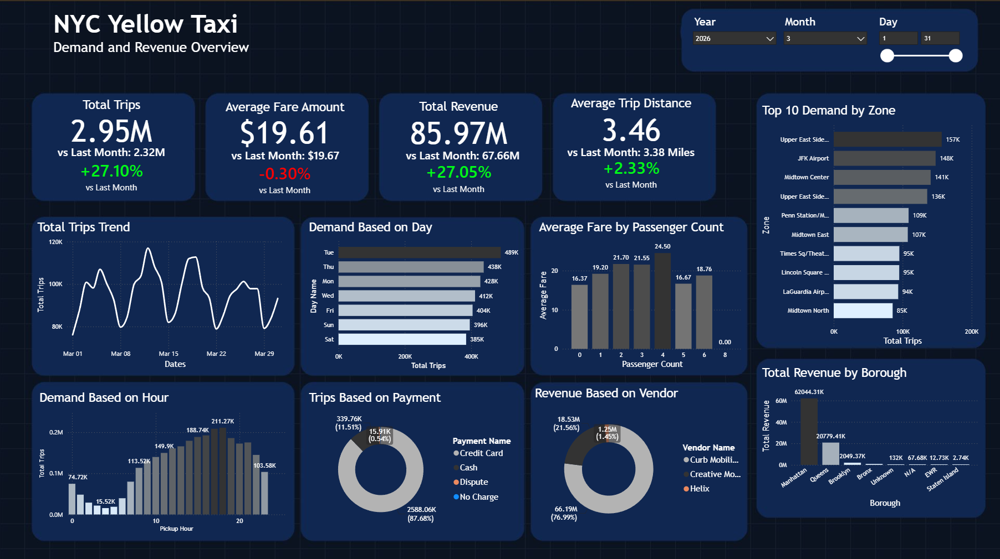

# NYC Taxi Data Pipeline

End-to-end data engineering pipeline for NYC Yellow Taxi trip data — from raw monthly TLC files to an analytics-ready dashboard, fully orchestrated and automated.

```
TLC (Parquet, monthly) → S3 (raw zone) → Snowflake (raw table) → dbt (staging → marts) → Power BI
                                  ▲
                          Airflow (Astro CLI) orchestrates the whole flow, end to end
```

## Why this project

This is a portfolio project built to demonstrate practical, end-to-end data engineering skills for the Indonesian job market: ingesting real-world data, designing an idempotent ETL pipeline with explicit state tracking, modeling a dimensional warehouse with dbt, and surfacing the result in a business-facing dashboard — all orchestrated and monitored through Airflow.

## Architecture

| Layer | Tool | Purpose |
|---|---|---|
| Extract | `requests` | Check availability (HTTP HEAD) and download monthly Yellow Taxi trip data (Parquet) from the official TLC source |
| Data lake | AWS S3 | Landing zone for raw Parquet files |
| Data warehouse | Snowflake | Raw landing table + dbt-transformed staging/marts |
| State tracking | `EtlControl` (Python) | Custom pipeline state machine backed by a Snowflake control table |
| Transformation | dbt-core + dbt-snowflake | Staging (cleaning) → Marts (dimensional model) |
| Orchestration | Apache Airflow (Astro CLI) | Schedules and chains every step; dbt is run via `@task.bash` |
| Alerting | SMTP notification | Email alert on task failure, via Airflow's `on_failure_callback` |
| Visualization | Power BI | Dashboard overview of demand, revenue, and operational patterns |
| Testing | pytest, pytest-mock, dbt tests | Unit tests for pipeline logic; schema/data tests for dbt models |

### Why ELT, not ETL

Cleaning and business logic live entirely inside dbt (in Snowflake), not in a separate Python/Spark processing layer. For the data volume involved (a few million rows per month), a dedicated processing engine like PySpark would be overkill — Snowflake's compute is more than sufficient, and keeping all transformation logic in SQL/dbt keeps the pipeline simpler, more testable, and easier to reason about.

## Pipeline flow (Airflow DAG)

```
check_available_months
        |
        v
   has_new_data --(no new data)--> [extract & load skipped, dbt still runs]
        |
        v (new data found)
   extract_to_s3
        |
        v
    load_to_snowflakes (COPY INTO Snowflake)
        |
        v
  running_dbt (seed -> run -> test)
```

- Scheduled `@monthly`, but designed to be safely re-run anytime — every step is idempotent.
- If there's no new month to process, extract/load are skipped via a short-circuit task, but **dbt still runs** (`trigger_rule=NO_FAILED`) so that model/test changes are always applied regardless of new data availability.
- `year` is derived from the DAG's logical date (`ds`), with an optional `params.year` override for manual backfills of historical years.
- On any task failure, an email alert is sent via SMTP with the failing DAG/task name and the exception.

## State tracking: `EtlControl`

A custom Python class backed by a `staging.etl_control` table in Snowflake, acting as the single source of truth for what has and hasn't been processed — designed to avoid two specific failure modes:

1. **Re-downloading files that already exist in S3** — `get_months_needing_download()` checks status, not just file presence, so a load failure doesn't trigger a wasteful re-download.
2. **Silently losing track of a failed load** — months stuck at `downloaded` (file in S3, but not yet in Snowflake) are always picked up again by `get_months_needing_load()`, regardless of how many times the load step previously failed.

`EtlControl` uses dependency injection (`connection_provider`, a zero-argument callable) for its Snowflake connection, so it works identically whether the connection comes from `SnowflakeHook` (in Airflow) or `snowflake.connector`.

## Data model (dbt)

**Staging** — one model per raw source, casts types and filters invalid rows (e.g. non-positive `trip_distance`). `payment_type` is intentionally *not* filtered, since codes like "Unknown" and "Voided trip" are valid business states per the official TLC data dictionary, not data quality issues.

**Marts** — a star schema, built with intentional dimensional modeling rather than pre-joined denormalized tables:

| Table | Type | Notes |
|---|---|---|
| `fct_trips` | Fact | Foreign keys only (vendor, rate code, payment, pickup/dropoff zone) — no pre-joined zone names |
| `dim_zone` | Dimension | NYC TLC Taxi Zone Lookup, loaded via dbt seed (static CSV) |
| `dim_payment`, `dim_ratecode`, `dim_vendor` | Dimension | Hardcoded lookups sourced from the official TLC data dictionary — kept independent of `fct_trips` so every official code is always present, even if it hasn't appeared yet in the ingested data |
| `dim_date` | Dimension | Generated via `dbt_utils.date_spine()` |
| `daily_demand_by_zone`, `hourly_demand`, `daily_vendor_performance`, `daily_payment_breakdown` | Aggregate marts | Pre-aggregated, dashboard-ready tables — joins and `GROUP BY` happen here, not in the BI tool |

## Dashboard

Built in Power BI, connected directly to the Snowflake marts. A single overview page with:
- KPI cards (total trips, average fare, total revenue, average trip distance)
- Daily trip trend
- Demand by hour of day (rush-hour pattern)
- Demand by day
- Average Fare by passenger count
- Revenue by vendor 
- Trips by payment type
- Top 10 Demand by Pickup Zone
- Revenue by borough
- Year / Month / Day slicers, synced across all visuals via a shared date dimension



Insight:
- March 2026 experienced substantial growth in overall volume and revenue compared to the previous month, heavily driven by higher trip volumes rather than increased individual fare amounts.
- Hourly Demand: Taxi usage is heavily concentrated in the late afternoon and evening. Demand picks up sharply starting around 10:00 AM, peaking significantly during evening rush hours—specifically hitting a high of 211.27K trips at 6:00 PM (hour 18).
- Weekly Demand: Tuesdays and Thursdays are the highest-demand days of the week, reaching 489K and 438K total trips respectively. Saturdays and Sundays experience the lowest demand, indicating that yellow taxi usage this month remains heavily anchored around weekday business and commuting schedules.
- Manhattan completely dominates revenue generation, pulling in over $62.04M (the vast majority of the $85.97M total), followed by Queens at $20.78M. Other boroughs like Brooklyn ($2.05M) register very low yellow cab footprints.
- The highest specific demand centers are concentrated around upper Manhattan and major transit hubs. The top three zones by total trips are Upper East Side North (157K), JFK Airport (148K), and Midtown Center (141K).
- Digital and card payments rule the market. Credit Cards account for 87.88% (2.59M trips) of all transactions, while Cash only makes up 11.51% (339.76K trips).


## Project structure

```
nyc-taxi-pipeline/
├── dags/
│   └── nyc_taxi_pipeline.py
├── include/
│   ├── etl_control.py
│   ├── extract.py
│   ├── loading.py
│   ├── logging.py
│   └── email_content.html
├── dbt/
│   └── nyc_taxi_dbt/
│       ├── models/
│       │   ├── staging/
│       │   └── marts/
│       ├── seeds/
│       ├── profiles.yml
│       └── dbt_project.yml
├── tests/
├── requirements.txt
├── .env.example
└── README.md
```

## Running locally

**Prerequisites:** Docker, Astro CLI, an AWS account with an S3 bucket, a Snowflake account.

```bash
# 1. Clone and configure
git clone <repo-url>
cd nyc-taxi-pipeline
cp .env.example .env   # fill in AWS, Snowflake, and SMTP credentials

# 2. Start Airflow
astro dev start

# 3. In the Airflow UI (localhost:8080), trigger nyc_taxi_pipeline
#    or trigger with a config override to backfill a specific year:
#    {"year": 2023}
```

```bash
# Run dbt manually (inside the Astro container)
astro dev bash
cd dbt/nyc_taxi_dbt
dbt seed && dbt run && dbt test
```

```bash
# Run unit tests
pytest -v
```

## Design decisions worth highlighting

- **Idempotent by design** — every extract/load step checks `EtlControl` state before doing any work, so re-running the DAG never duplicates data or wastes a network call.
- **Dimensional modeling over convenience joins** — `fct_trips` deliberately holds only foreign keys, not denormalized zone/payment names, following standard star schema practice rather than optimizing for "easy to query directly."
- **Hardcoded dimension tables for small, stable code sets** — `dim_payment`, `dim_ratecode`, and `dim_vendor` are static lookups derived from official documentation, not `DISTINCT`-ed from the fact table, so they're always complete regardless of what's actually present in a given data sample.
- **dbt via `BashOperator`, not Astronomer Cosmos** — for a project of this size (a handful of models), per-model task granularity wasn't worth the added setup complexity; this is a deliberate trade-off, not an oversight.
- **S3 files are never moved after loading** — `EtlControl` is the single source of truth for what's been processed, so a separate "processed" folder convention would add complexity without improving correctness.
